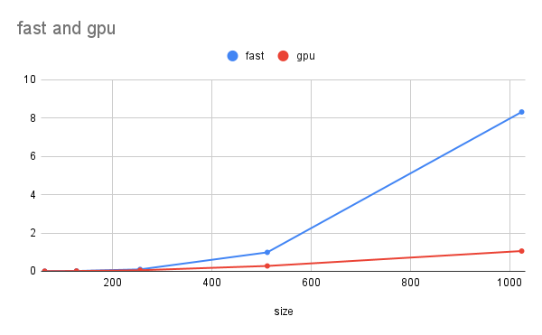

# MiniTorch Module 3


* Docs: https://minitorch.github.io/

* Overview: https://minitorch.github.io/module3.html


You will need to modify `tensor_functions.py` slightly in this assignment.

* Tests:

```
python run_tests.py
```

* Note:

Several of the tests for this assignment will only run if you are on a GPU machine and will not
run on github's test infrastructure. Please follow the instructions to setup up a colab machine
to run these tests.

This assignment requires the following files from the previous assignments. You can get these by running

```bash
python sync_previous_module.py previous-module-dir current-module-dir
```

The files that will be synced are:

        minitorch/tensor_data.py minitorch/tensor_functions.py minitorch/tensor_ops.py minitorch/operators.py minitorch/scalar.py minitorch/scalar_functions.py minitorch/module.py minitorch/autodiff.py minitorch/module.py project/run_manual.py project/run_scalar.py project/run_tensor.py minitorch/operators.py minitorch/module.py minitorch/autodiff.py minitorch/tensor.py minitorch/datasets.py minitorch/testing.py minitorch/optim.py

3.1 parallel analysis script output:
```
MAP

================================================================================
 Parallel Accelerator Optimizing:  Function tensor_map.<locals>._map,
C:\Users\rubyj\Documents\Cornell_Tech\MLE\mod3-JuliaYu2002\minitorch\fast_ops.py
 (166)
================================================================================


Parallel loop listing for  Function tensor_map.<locals>._map, C:\Users\rubyj\Documents\Cornell_Tech\MLE\mod3-JuliaYu2002\minitorch\fast_ops.py (166)
------------------------------------------------------------------------------------------------------------------------------------------------------------|loop #ID
    def _map(                                                                                                                                               |
        out: Storage,                                                                                                                                       |
        out_shape: Shape,                                                                                                                                   |
        out_strides: Strides,                                                                                                                               |
        in_storage: Storage,                                                                                                                                |
        in_shape: Shape,                                                                                                                                    |
        in_strides: Strides,                                                                                                                                |
    ) -> None:                                                                                                                                              |
        # TODO: Implement for Task 3.1.                                                                                                                     |
        x = np.array_equal(in_strides, out_strides) and np.array_equal(in_shape, out_shape)                                                                 |
        for i in prange(len(out)):--------------------------------------------------------------------------------------------------------------------------| #0
            out_index = np.empty(MAX_DIMS, np.int32)                                                                                                        |
            in_index = np.empty(MAX_DIMS, np.int32) # these are the numpy buffers                                                                           |
            if x: # strides and shape aligned                                                                                                               |
                out[i] = fn(in_storage[i]) # save value                                                                                                     |
            else:                                                                                                                                           |
                to_index(i, out_shape, out_index) # get index of the i of the thread we're in (prange makes as many threads as indicated by the param)      |
                broadcast_index(out_index, out_shape, in_shape, in_index) # convert the index in the out shape into the equivalent index in the in shape    |
                o = index_to_position(out_index, out_strides) # get the storage indices in the respective tensors                                           |
                j = index_to_position(in_index, in_strides)                                                                                                 |
                out[o] = fn(in_storage[j]) # save value                                                                                                     |
--------------------------------- Fusing loops ---------------------------------
Attempting fusion of parallel loops (combines loops with similar properties)...
Following the attempted fusion of parallel for-loops there are 1 parallel for-
loop(s) (originating from loops labelled: #0).
--------------------------------------------------------------------------------
----------------------------- Before Optimisation ------------------------------
--------------------------------------------------------------------------------
------------------------------ After Optimisation ------------------------------
Parallel structure is already optimal.
--------------------------------------------------------------------------------
--------------------------------------------------------------------------------

---------------------------Loop invariant code motion---------------------------
Allocation hoisting:
The memory allocation derived from the instruction at
C:\Users\rubyj\Documents\Cornell_Tech\MLE\mod3-JuliaYu2002\minitorch\fast_ops.py
 (177) is hoisted out of the parallel loop labelled #0 (it will be performed
before the loop is executed and reused inside the loop):
   Allocation:: out_index = np.empty(MAX_DIMS, np.int32)
    - numpy.empty() is used for the allocation.
The memory allocation derived from the instruction at
C:\Users\rubyj\Documents\Cornell_Tech\MLE\mod3-JuliaYu2002\minitorch\fast_ops.py
 (178) is hoisted out of the parallel loop labelled #0 (it will be performed
before the loop is executed and reused inside the loop):
   Allocation:: in_index = np.empty(MAX_DIMS, np.int32) # these are the numpy
buffers
    - numpy.empty() is used for the allocation.
None
ZIP

================================================================================
 Parallel Accelerator Optimizing:  Function tensor_zip.<locals>._zip,
C:\Users\rubyj\Documents\Cornell_Tech\MLE\mod3-JuliaYu2002\minitorch\fast_ops.py
 (214)
================================================================================


Parallel loop listing for  Function tensor_zip.<locals>._zip, C:\Users\rubyj\Documents\Cornell_Tech\MLE\mod3-JuliaYu2002\minitorch\fast_ops.py (214)
---------------------------------------------------------------------------------------------------|loop #ID
    def _zip(                                                                                      |
        out: Storage,                                                                              |
        out_shape: Shape,                                                                          |
        out_strides: Strides,                                                                      |
        a_storage: Storage,                                                                        |
        a_shape: Shape,                                                                            |
        a_strides: Strides,                                                                        |
        b_storage: Storage,                                                                        |
        b_shape: Shape,                                                                            |
        b_strides: Strides,                                                                        |
    ) -> None:                                                                                     |
        # TODO: Implement for Task 3.1.                                                            |
        x = np.array_equal(a_strides, b_strides) and np.array_equal(a_strides, out_strides) \      |
            and np.array_equal(b_strides, out_strides) and np.array_equal(a_shape, b_shape) \      |
                and np.array_equal(a_shape, out_shape) and np.array_equal(b_shape, out_shape)      |
        for i in prange(len(out)):-----------------------------------------------------------------| #1
            out_index = np.empty(MAX_DIMS, np.int32)                                               |
            a_index = np.empty(MAX_DIMS, np.int32)                                                 |
            b_index = np.empty(MAX_DIMS, np.int32)                                                 |
            if x:                                                                                  |
                out[i] = fn(a_storage[i], b_storage[i]) # if aligned, directly fill in out at i    |
            else:                                                                                  |
                to_index(i, out_shape, out_index)                                                  |
                o = index_to_position(out_index, out_strides)                                      |
                broadcast_index(out_index, out_shape, a_shape, a_index)                            |
                j = index_to_position(a_index, a_strides)                                          |
                broadcast_index(out_index, out_shape, b_shape, b_index)                            |
                k = index_to_position(b_index, b_strides)                                          |
                out[o] = fn(a_storage[j], b_storage[k])                                            |
--------------------------------- Fusing loops ---------------------------------
Attempting fusion of parallel loops (combines loops with similar properties)...
Following the attempted fusion of parallel for-loops there are 1 parallel for-
loop(s) (originating from loops labelled: #1).
--------------------------------------------------------------------------------
----------------------------- Before Optimisation ------------------------------
--------------------------------------------------------------------------------
------------------------------ After Optimisation ------------------------------
Parallel structure is already optimal.
--------------------------------------------------------------------------------
--------------------------------------------------------------------------------

---------------------------Loop invariant code motion---------------------------
Allocation hoisting:
The memory allocation derived from the instruction at
C:\Users\rubyj\Documents\Cornell_Tech\MLE\mod3-JuliaYu2002\minitorch\fast_ops.py
 (230) is hoisted out of the parallel loop labelled #1 (it will be performed
before the loop is executed and reused inside the loop):
   Allocation:: out_index = np.empty(MAX_DIMS, np.int32)
    - numpy.empty() is used for the allocation.
The memory allocation derived from the instruction at
C:\Users\rubyj\Documents\Cornell_Tech\MLE\mod3-JuliaYu2002\minitorch\fast_ops.py
 (231) is hoisted out of the parallel loop labelled #1 (it will be performed
before the loop is executed and reused inside the loop):
   Allocation:: a_index = np.empty(MAX_DIMS, np.int32)
    - numpy.empty() is used for the allocation.
The memory allocation derived from the instruction at
C:\Users\rubyj\Documents\Cornell_Tech\MLE\mod3-JuliaYu2002\minitorch\fast_ops.py
 (232) is hoisted out of the parallel loop labelled #1 (it will be performed
before the loop is executed and reused inside the loop):
   Allocation:: b_index = np.empty(MAX_DIMS, np.int32)
    - numpy.empty() is used for the allocation.
None
REDUCE

================================================================================
 Parallel Accelerator Optimizing:  Function tensor_reduce.<locals>._reduce,
C:\Users\rubyj\Documents\Cornell_Tech\MLE\mod3-JuliaYu2002\minitorch\fast_ops.py
 (268)
================================================================================


Parallel loop listing for  Function tensor_reduce.<locals>._reduce, C:\Users\rubyj\Documents\Cornell_Tech\MLE\mod3-JuliaYu2002\minitorch\fast_ops.py (268)
-------------------------------------------------------------|loop #ID
    def _reduce(                                             |
        out: Storage,                                        |
        out_shape: Shape,                                    |
        out_strides: Strides,                                |
        a_storage: Storage,                                  |
        a_shape: Shape,                                      |
        a_strides: Strides,                                  |
        reduce_dim: int,                                     |
    ) -> None:                                               |
        # TODO: Implement for Task 3.1.                      |
        reduce_size = a_shape[reduce_dim]                    |
        for i in prange(len(out)):---------------------------| #2
            out_index = np.empty(MAX_DIMS, np.int32)         |
            to_index(i, out_shape, out_index)                |
            o = index_to_position(out_index, out_strides)    |
            j = index_to_position(out_index, a_strides)      |
            for s in range(reduce_size):                     |
                out_index[reduce_dim] = s                    |
                out[o] = fn(out[o], a_storage[j])            |
                j += a_strides[reduce_dim]                   |
--------------------------------- Fusing loops ---------------------------------
Attempting fusion of parallel loops (combines loops with similar properties)...
Following the attempted fusion of parallel for-loops there are 1 parallel for-
loop(s) (originating from loops labelled: #2).
--------------------------------------------------------------------------------
----------------------------- Before Optimisation ------------------------------
--------------------------------------------------------------------------------
------------------------------ After Optimisation ------------------------------
Parallel structure is already optimal.
--------------------------------------------------------------------------------
--------------------------------------------------------------------------------

---------------------------Loop invariant code motion---------------------------
Allocation hoisting:
The memory allocation derived from the instruction at
C:\Users\rubyj\Documents\Cornell_Tech\MLE\mod3-JuliaYu2002\minitorch\fast_ops.py
 (280) is hoisted out of the parallel loop labelled #2 (it will be performed
before the loop is executed and reused inside the loop):
   Allocation:: out_index = np.empty(MAX_DIMS, np.int32)
    - numpy.empty() is used for the allocation.
None
```

3.2 parallel analysis script output:
```
MATRIX MULTIPLY

================================================================================
 Parallel Accelerator Optimizing:  Function _tensor_matrix_multiply,
C:\Users\rubyj\Documents\Cornell_Tech\MLE\mod3-JuliaYu2002\minitorch\fast_ops.py
 (292)
================================================================================


Parallel loop listing for  Function _tensor_matrix_multiply, C:\Users\rubyj\Documents\Cornell_Tech\MLE\mod3-JuliaYu2002\minitorch\fast_ops.py (292)
------------------------------------------------------------------------------------------------------------------------------|loop #ID
def _tensor_matrix_multiply(                                                                                                  |
    out: Storage,                                                                                                             |
    out_shape: Shape,                                                                                                         |
    out_strides: Strides,                                                                                                     |
    a_storage: Storage,                                                                                                       |
    a_shape: Shape,                                                                                                           |
    a_strides: Strides,                                                                                                       |
    b_storage: Storage,                                                                                                       |
    b_shape: Shape,                                                                                                           |
    b_strides: Strides,                                                                                                       |
) -> None:                                                                                                                    |
    """NUMBA tensor matrix multiply function.                                                                                 |
                                                                                                                              |
    Should work for any tensor shapes that broadcast as long as                                                               |
                                                                                                                              |
    ```                                                                                                                       |
    assert a_shape[-1] == b_shape[-2]                                                                                         |
    ```                                                                                                                       |
                                                                                                                              |
    Optimizations:                                                                                                            |
                                                                                                                              |
    * Outer loop in parallel                                                                                                  |
    * No index buffers or function calls                                                                                      |
    * Inner loop should have no global writes, 1 multiply.                                                                    |
                                                                                                                              |
                                                                                                                              |
    Args:                                                                                                                     |
    ----                                                                                                                      |
        out (Storage): storage for `out` tensor                                                                               |
        out_shape (Shape): shape for `out` tensor                                                                             |
        out_strides (Strides): strides for `out` tensor                                                                       |
        a_storage (Storage): storage for `a` tensor                                                                           |
        a_shape (Shape): shape for `a` tensor                                                                                 |
        a_strides (Strides): strides for `a` tensor                                                                           |
        b_storage (Storage): storage for `b` tensor                                                                           |
        b_shape (Shape): shape for `b` tensor                                                                                 |
        b_strides (Strides): strides for `b` tensor                                                                           |
                                                                                                                              |
    Returns:                                                                                                                  |
    -------                                                                                                                   |
        None : Fills in `out`                                                                                                 |
                                                                                                                              |
    """                                                                                                                       |
    a_batch_stride = a_strides[0] if a_shape[0] > 1 else 0 # if the tensor was already a 3d tensor before view adjustment     |
    b_batch_stride = b_strides[0] if b_shape[0] > 1 else 0 # the number to get to the next depth in storage                   |
    # TODO: Implement for Task 3.2.                                                                                           |
                                                                                                                              |
    # deeper = a_shape[0] if (a_shape[0] >= b_shape[0]) else b_shape[0]                                                       |
    # a_shape[-1] = b_shape[-2] :: a's # columns must equal b's # rows                                                        |
    for out_pos in prange(len(out)):------------------------------------------------------------------------------------------| #3
        # getCol = int(out_pos % out_shape[2])                                                                                |
        # cur_ord = out_pos // out_shape[2]                                                                                   |
        # getRow = int(cur_ord % out_shape[1])                                                                                |
        # cur_ord = cur_ord // out_shape[0]                                                                                   |
        # getDepth = int(out_pos % out_shape[0])                                                                              |
                                                                                                                              |
        # the uncommented things below are from chat gpt after being fed the rest of the commented out code I have here       |
        batch_idx = (out_pos // out_strides[0]) % out_shape[0]                                                                |
        row_idx = (out_pos // out_strides[1]) % out_shape[1]                                                                  |
        col_idx = (out_pos // out_strides[2]) % out_shape[2]                                                                  |
        # ..., depth, row, col                                                                                                |
        dot_prod = 0                                                                                                          |
        for k in range(a_shape[-1]):  # Shared dimension                                                                      |
            a_idx = (                                                                                                         |
                batch_idx * a_batch_stride +                                                                                  |
                row_idx * a_strides[-2] +                                                                                     |
                k * a_strides[-1]                                                                                             |
            )                                                                                                                 |
            b_idx = (                                                                                                         |
                batch_idx * b_batch_stride +                                                                                  |
                k * b_strides[-2] +                                                                                           |
                col_idx * b_strides[-1]                                                                                       |
            )                                                                                                                 |
            dot_prod += a_storage[a_idx] * b_storage[b_idx]                                                                   |
                                                                                                                              |
        # Write to output storage                                                                                             |
        out[out_pos] = dot_prod                                                                                               |
                                                                                                                              |
        # for i in range(a_shape[-2]):                                                                                        |
        #     dot_prod = 0                                                                                                    |
        #     for j in range(b_shape[-1]):                                                                                    |
        #         if i == getRow and j == getCol:                                                                             |
        #             dot_prod += a_storage[getDepth * a_batch_stride + i * a_strides[-2] + j * a_strides[-1]] * \            |
        #                 b_storage[getDepth * b_batch_stride + j * b_strides[-1] + i * b_strides[-2]]                        |
        #     out[out_pos] = dot_prod                                                                                         |
        # for depth in range(deeper):                                                                                         |
        #     dot = 0                                                                                                         |
        #     if getDepth == depth:                                                                                           |
        #         for row in range(a_shape[-2]): # loop over a's rows                                                         |
        #             if row == getRow:                                                                                       |
        #                 for col in range(b_shape[-1]): # loop over b's columns                                              |
        #                     if col == getCol:                                                                               |
        #                     # if col == getCol and row == getRow and depth == getDepth:                                     |
        #                         dot += a_storage[depth * a_batch_stride + row * a_strides[-2] + col * a_strides[-1]] * \    |
        #                             b_storage[depth * b_batch_stride + col * b_strides[-1] + row * b_strides[-2]]           |
            # out[out_pos] = dot                                                                                              |
    # print(a_storage, a_shape)                                                                                               |
    # print(b_storage, b_shape)                                                                                               |
    # print(out, out_shape)                                                                                                   |
    # print()                                                                                                                 |
--------------------------------- Fusing loops ---------------------------------
Attempting fusion of parallel loops (combines loops with similar properties)...
Following the attempted fusion of parallel for-loops there are 1 parallel for-
loop(s) (originating from loops labelled: #3).
--------------------------------------------------------------------------------
----------------------------- Before Optimisation ------------------------------
--------------------------------------------------------------------------------
------------------------------ After Optimisation ------------------------------
Parallel structure is already optimal.
--------------------------------------------------------------------------------
--------------------------------------------------------------------------------

---------------------------Loop invariant code motion---------------------------
Allocation hoisting:
No allocation hoisting found
None
```

3.4 Graph file output



```
Running size 64
/usr/local/lib/python3.10/dist-packages/numba/cuda/dispatcher.py:536: NumbaPerformanceWarning: Grid size 8 will likely result in GPU under-utilization due to low occupancy.
  warn(NumbaPerformanceWarning(msg))
{'fast': 0.0037920475006103516, 'gpu': 0.006616910298665364}
Running size 128
/usr/local/lib/python3.10/dist-packages/numba/cuda/dispatcher.py:536: NumbaPerformanceWarning: Grid size 32 will likely result in GPU under-utilization due to low occupancy.
  warn(NumbaPerformanceWarning(msg))
{'fast': 0.01700735092163086, 'gpu': 0.015645821889241535}
Running size 256
{'fast': 0.09951567649841309, 'gpu': 0.0547942320505778}
Running size 512
{'fast': 0.9882652759552002, 'gpu': 0.2783406575520833}
Running size 1024
{'fast': 8.316306273142496, 'gpu': 1.0568815072377522}

Timing summary
Size: 64
    fast: 0.00379
    gpu: 0.00662
Size: 128
    fast: 0.01701
    gpu: 0.01565
Size: 256
    fast: 0.09952
    gpu: 0.05479
Size: 512
    fast: 0.98827
    gpu: 0.27834
Size: 1024
    fast: 8.31631
    gpu: 1.05688
```

CPU Runs:

Simple (```python ./project/run_fast_tensor.py --BACKEND cpu --HIDDEN 100 --DATASET simple --RATE 0.05```):
```
Epoch: 0  loss: 4.5800040476458745  correct: 43  Time / Epoch: 12.026366233825684
Epoch: 10  loss: 1.6613836893802265  correct: 49  Time / Epoch: 1.1523968306454746
Epoch: 20  loss: 1.002899657569296  correct: 46  Time / Epoch: 0.6353507496061779
Epoch: 30  loss: 0.309947631736825  correct: 50  Time / Epoch: 0.4518827699845837
Epoch: 40  loss: 1.3095890277714708  correct: 50  Time / Epoch: 0.3581552389191418
Epoch: 50  loss: 0.44736203786844986  correct: 50  Time / Epoch: 0.301007163290884
Epoch: 60  loss: 0.2837003432866409  correct: 50  Time / Epoch: 0.2625797537506604
Epoch: 70  loss: 0.30679206905764256  correct: 50  Time / Epoch: 0.23543515003902812
Epoch: 80  loss: 0.6728993808156953  correct: 50  Time / Epoch: 0.21470242665137773
Epoch: 90  loss: 0.7555987218693958  correct: 50  Time / Epoch: 0.19896590054690183
Epoch: 100  loss: 0.3539483247339958  correct: 50  Time / Epoch: 0.18656331949894972
Epoch: 110  loss: 0.590546234798125  correct: 50  Time / Epoch: 0.1759990593334576
Epoch: 120  loss: 0.36679873196126217  correct: 50  Time / Epoch: 0.16711484105133814
Epoch: 130  loss: 0.4261575444306144  correct: 50  Time / Epoch: 0.15961752229064474
Epoch: 140  loss: 0.3708321163600653  correct: 50  Time / Epoch: 0.1532442011731736
Epoch: 150  loss: 0.38998986892530135  correct: 50  Time / Epoch: 0.14765849492407793
Epoch: 160  loss: 0.27818582140111864  correct: 50  Time / Epoch: 0.14285983061938554
Epoch: 170  loss: 0.20362261964432654  correct: 50  Time / Epoch: 0.1386165758322554
Epoch: 180  loss: 0.009706609513939042  correct: 50  Time / Epoch: 0.13483114400621277
Epoch: 190  loss: 0.10897481354151854  correct: 50  Time / Epoch: 0.1314472902507682
Epoch: 200  loss: 0.46254374597187403  correct: 50  Time / Epoch: 0.12837031112974556
Epoch: 210  loss: 0.04162699026619783  correct: 50  Time / Epoch: 0.12565207707373452
Epoch: 220  loss: 0.13648347273419112  correct: 50  Time / Epoch: 0.12320175645577962
Epoch: 230  loss: 0.07031146634656793  correct: 50  Time / Epoch: 0.12094627211104224
Epoch: 240  loss: 0.4707998411397815  correct: 50  Time / Epoch: 0.11888626205475993
Epoch: 250  loss: 0.12373521107337934  correct: 50  Time / Epoch: 0.11700632752650288
Epoch: 260  loss: 0.2369934434299239  correct: 50  Time / Epoch: 0.1152781152177131
Epoch: 270  loss: 0.09637849030329826  correct: 50  Time / Epoch: 0.11366637870394436
Epoch: 280  loss: 0.2706478573015015  correct: 50  Time / Epoch: 0.11216516002641454
Epoch: 290  loss: 0.034555433678553724  correct: 50  Time / Epoch: 0.11092237754376073
Epoch: 300  loss: 0.044621853937447165  correct: 50  Time / Epoch: 0.10966913644657579
Epoch: 310  loss: 0.05326618615819112  correct: 50  Time / Epoch: 0.10858331232592223
Epoch: 320  loss: 0.046726333114192956  correct: 50  Time / Epoch: 0.10747669790392723
Epoch: 330  loss: 0.2732345888257394  correct: 50  Time / Epoch: 0.10642154123127641
Epoch: 340  loss: 0.39984241774092705  correct: 50  Time / Epoch: 0.10542091246574156
Epoch: 350  loss: 0.256583850285184  correct: 50  Time / Epoch: 0.1045215625708599
Epoch: 360  loss: 0.0027461102861020942  correct: 50  Time / Epoch: 0.10365116034848539
Epoch: 370  loss: 0.17975480462706311  correct: 50  Time / Epoch: 0.10286541383542783
Epoch: 380  loss: 0.07007176271748922  correct: 50  Time / Epoch: 0.1022075449074973
Epoch: 390  loss: 0.006176629697108475  correct: 50  Time / Epoch: 0.10148866707101807
Epoch: 400  loss: 0.05799804600499821  correct: 50  Time / Epoch: 0.10079568044800413
Epoch: 410  loss: 0.16198582542190856  correct: 50  Time / Epoch: 0.10014128684997559
Epoch: 420  loss: 0.06542194232170785  correct: 50  Time / Epoch: 0.09951450649179926
Epoch: 430  loss: 0.030981495596589494  correct: 50  Time / Epoch: 0.09892948099742632
Epoch: 440  loss: 0.24916530420020114  correct: 50  Time / Epoch: 0.09841634302723165
Epoch: 450  loss: 0.019584231419572478  correct: 50  Time / Epoch: 0.09790054604642406
Epoch: 460  loss: 0.030418421737153742  correct: 50  Time / Epoch: 0.09739770961687001
Epoch: 470  loss: 0.03813280426561414  correct: 50  Time / Epoch: 0.09721304302256072
Epoch: 480  loss: 0.14191688587688156  correct: 50  Time / Epoch: 0.09696745128988477
Epoch: 490  loss: 0.0076930613612767994  correct: 50  Time / Epoch: 0.09667483706581131
Epoch: 500  loss: 0.2018398525954493  correct: 50  Time / Epoch: 0.09629809023615367
```

Split (```python ./project/run_fast_tensor.py --BACKEND cpu --HIDDEN 100 --DATASET split --RATE 0.05```):
```
Epoch: 0  loss: 6.681509945566434  correct: 29  Time / Epoch: 12.031030654907227
Epoch: 10  loss: 5.6315962426550215  correct: 42  Time / Epoch: 1.1542746153744785
Epoch: 20  loss: 4.645528398792468  correct: 42  Time / Epoch: 0.6379533722287133
Epoch: 30  loss: 4.603610347835169  correct: 44  Time / Epoch: 0.4537103560663039
Epoch: 40  loss: 3.2223569235844387  correct: 45  Time / Epoch: 0.3592688048758158
Epoch: 50  loss: 2.76378665853776  correct: 46  Time / Epoch: 0.3018239385941449
Epoch: 60  loss: 3.3873690218579844  correct: 48  Time / Epoch: 0.26344101155390504
Epoch: 70  loss: 1.0569481120655075  correct: 47  Time / Epoch: 0.2366444426523128
Epoch: 80  loss: 2.301909293596685  correct: 47  Time / Epoch: 0.21642908049218448
Epoch: 90  loss: 1.4102341092789437  correct: 47  Time / Epoch: 0.20007424040155097
Epoch: 100  loss: 2.082645904463108  correct: 50  Time / Epoch: 0.18694807515285983
Epoch: 110  loss: 1.722965764353907  correct: 48  Time / Epoch: 0.17625004965979774
Epoch: 120  loss: 1.3260394364239696  correct: 48  Time / Epoch: 0.16731203094986843
Epoch: 130  loss: 0.9028542828852085  correct: 50  Time / Epoch: 0.1599867416702154
Epoch: 140  loss: 0.9487274999462585  correct: 48  Time / Epoch: 0.15364016708752787
Epoch: 150  loss: 0.28296436634994426  correct: 48  Time / Epoch: 0.14806134811300314
Epoch: 160  loss: 1.183133778004505  correct: 50  Time / Epoch: 0.14330914894246166
Epoch: 170  loss: 0.8984084228656657  correct: 50  Time / Epoch: 0.13906299858762508
Epoch: 180  loss: 0.5816092355393891  correct: 50  Time / Epoch: 0.13528603875176023
Epoch: 190  loss: 1.1740219275744348  correct: 50  Time / Epoch: 0.13228153308648713
Epoch: 200  loss: 0.1877701342712386  correct: 48  Time / Epoch: 0.12921777649305352
Epoch: 210  loss: 0.13406943453886044  correct: 50  Time / Epoch: 0.12647792626331203
Epoch: 220  loss: 0.9638060773055592  correct: 50  Time / Epoch: 0.123976663226995
Epoch: 230  loss: 0.24319043314311695  correct: 49  Time / Epoch: 0.12172659444602536
Epoch: 240  loss: 0.619726041357972  correct: 50  Time / Epoch: 0.11960101028695641
Epoch: 250  loss: 2.276672152658  correct: 48  Time / Epoch: 0.11771064545528823
Epoch: 260  loss: 0.6107285139582413  correct: 50  Time / Epoch: 0.11623515845258574
Epoch: 270  loss: 0.22369383223830583  correct: 50  Time / Epoch: 0.11497208201137415
Epoch: 280  loss: 0.5160612697244092  correct: 50  Time / Epoch: 0.11353891260683324
Epoch: 290  loss: 0.7171632644444176  correct: 50  Time / Epoch: 0.11215304754853658
Epoch: 300  loss: 0.24298685407906132  correct: 50  Time / Epoch: 0.11086251410931051
Epoch: 310  loss: 0.21887273359871567  correct: 50  Time / Epoch: 0.1097030233340248
Epoch: 320  loss: 1.1370491762733221  correct: 50  Time / Epoch: 0.10857844129901066
Epoch: 330  loss: 0.4746997132483596  correct: 50  Time / Epoch: 0.10747939582317617
Epoch: 340  loss: 0.8078197713028574  correct: 50  Time / Epoch: 0.10648592266519048
Epoch: 350  loss: 0.27351444772020495  correct: 50  Time / Epoch: 0.10558187927615609
Epoch: 360  loss: 0.12982690082761153  correct: 50  Time / Epoch: 0.10472642285671921
Epoch: 370  loss: 0.8707064537408453  correct: 50  Time / Epoch: 0.10392517092414301
Epoch: 380  loss: 0.2128967454491682  correct: 50  Time / Epoch: 0.1033759542650438
Epoch: 390  loss: 0.24503025911296794  correct: 50  Time / Epoch: 0.1028614373463194
Epoch: 400  loss: 0.4489097790706964  correct: 50  Time / Epoch: 0.10229132775951205
Epoch: 410  loss: 0.16021788627473194  correct: 50  Time / Epoch: 0.10167109995282769
Epoch: 420  loss: 0.5757306582781994  correct: 50  Time / Epoch: 0.1010482990826677
Epoch: 430  loss: 0.27871464768969006  correct: 50  Time / Epoch: 0.10054137535272231
Epoch: 440  loss: 0.39415907917371773  correct: 50  Time / Epoch: 0.10003930316760697
Epoch: 450  loss: 0.33031514962947733  correct: 50  Time / Epoch: 0.09958832068348142
Epoch: 460  loss: 0.37117069621180315  correct: 50  Time / Epoch: 0.0991026739753508
Epoch: 470  loss: 0.37197377418211086  correct: 50  Time / Epoch: 0.09864614369256734
Epoch: 480  loss: 0.28197814819358125  correct: 50  Time / Epoch: 0.0985641033386738
Epoch: 490  loss: 0.44734910504819003  correct: 50  Time / Epoch: 0.0982226733034837
Epoch: 500  loss: 0.10296523840959784  correct: 50  Time / Epoch: 0.0978010628751652
```

Xor (```python ./project/run_fast_tensor.py --BACKEND cpu --HIDDEN 100 --DATASET xor --RATE 0.05```):
```
Epoch: 0  loss: 5.068772585761547  correct: 44  Time / Epoch: 13.790388584136963
Epoch: 10  loss: 4.105021972036129  correct: 46  Time / Epoch: 1.3303989497098057
Epoch: 20  loss: 1.8278564057237632  correct: 46  Time / Epoch: 0.7424963769458589
Epoch: 30  loss: 3.9488149034463853  correct: 47  Time / Epoch: 0.5324330483713458
Epoch: 40  loss: 1.9689600144033244  correct: 47  Time / Epoch: 0.42318106279140566
Epoch: 50  loss: 1.7061719157503141  correct: 47  Time / Epoch: 0.35655735053268134
Epoch: 60  loss: 2.1578339367894768  correct: 48  Time / Epoch: 0.31244956079076547
Epoch: 70  loss: 0.30670071966210666  correct: 48  Time / Epoch: 0.2804707540592677
Epoch: 80  loss: 3.1612607164207285  correct: 50  Time / Epoch: 0.2562274491345441
Epoch: 90  loss: 2.929663501218087  correct: 48  Time / Epoch: 0.23733431952340261
Epoch: 100  loss: 0.7791863515210996  correct: 48  Time / Epoch: 0.22235075081929123
Epoch: 110  loss: 1.2150300471978135  correct: 48  Time / Epoch: 0.21005787076176824
Epoch: 120  loss: 0.7469713313407107  correct: 49  Time / Epoch: 0.1998134151963163
Epoch: 130  loss: 1.843770904656535  correct: 48  Time / Epoch: 0.19040018001585515
Epoch: 140  loss: 0.7437085698859575  correct: 50  Time / Epoch: 0.18209899401833826
Epoch: 150  loss: 0.39947135202274664  correct: 48  Time / Epoch: 0.17485402435656414
Epoch: 160  loss: 0.35151645982459684  correct: 50  Time / Epoch: 0.16853389680755804
Epoch: 170  loss: 0.49264437470915423  correct: 48  Time / Epoch: 0.1630172952573899
Epoch: 180  loss: 0.3048987059824373  correct: 50  Time / Epoch: 0.1585156680470672
Epoch: 190  loss: 2.441366487716837  correct: 49  Time / Epoch: 0.15437348600457476
Epoch: 200  loss: 0.08112723434104505  correct: 50  Time / Epoch: 0.15056385685555376
Epoch: 210  loss: 1.4066841090341105  correct: 50  Time / Epoch: 0.14724545456221882
Epoch: 220  loss: 2.5166951688544628  correct: 50  Time / Epoch: 0.14478185921233164
Epoch: 230  loss: 1.09457376542297  correct: 49  Time / Epoch: 0.142726367686218
Epoch: 240  loss: 1.23164559192509  correct: 50  Time / Epoch: 0.1406339926343736
Epoch: 250  loss: 0.6567167159497996  correct: 48  Time / Epoch: 0.13859279127234958
Epoch: 260  loss: 0.40865202614995544  correct: 49  Time / Epoch: 0.13642066283244283
Epoch: 270  loss: 0.050736252414309624  correct: 49  Time / Epoch: 0.13446048265013746
Epoch: 280  loss: 0.41814303060686614  correct: 49  Time / Epoch: 0.1328782602561326
Epoch: 290  loss: 0.669628941897075  correct: 49  Time / Epoch: 0.13105082839624987
Epoch: 300  loss: 0.8070905688864056  correct: 49  Time / Epoch: 0.1293266896789652
Epoch: 310  loss: 0.44984741825951374  correct: 49  Time / Epoch: 0.1279272527173401
Epoch: 320  loss: 0.1653194288448933  correct: 49  Time / Epoch: 0.1265961834203417
Epoch: 330  loss: 0.13832773179327867  correct: 50  Time / Epoch: 0.12538481406935031
Epoch: 340  loss: 0.5990562389858143  correct: 49  Time / Epoch: 0.12424449696918387
Epoch: 350  loss: 0.9560655449343552  correct: 50  Time / Epoch: 0.12310647692775455
Epoch: 360  loss: 0.15445064692974542  correct: 49  Time / Epoch: 0.12190131269333435
Epoch: 370  loss: 0.14439854457017756  correct: 49  Time / Epoch: 0.12076650411292228
Epoch: 380  loss: 1.2506250710169402  correct: 50  Time / Epoch: 0.11967814500563413
Epoch: 390  loss: 0.5623256037887262  correct: 50  Time / Epoch: 0.11875287895007512
Epoch: 400  loss: 0.3123904011631421  correct: 49  Time / Epoch: 0.11791115805989787
Epoch: 410  loss: 0.4934512839862727  correct: 49  Time / Epoch: 0.11699604524023051
Epoch: 420  loss: 0.9605111189095311  correct: 49  Time / Epoch: 0.1161339056463536
Epoch: 430  loss: 0.13448200743110963  correct: 50  Time / Epoch: 0.11530481026510075
Epoch: 440  loss: 0.09783873258325017  correct: 50  Time / Epoch: 0.11446796631326481
Epoch: 450  loss: 0.3337247843076179  correct: 50  Time / Epoch: 0.11382592332336697
Epoch: 460  loss: 0.5785130932883406  correct: 50  Time / Epoch: 0.11321339224527818
Epoch: 470  loss: 0.1078449206945533  correct: 50  Time / Epoch: 0.11249123814252784
Epoch: 480  loss: 0.042697028280484856  correct: 50  Time / Epoch: 0.11186771928148805
Epoch: 490  loss: 0.8680693952358941  correct: 49  Time / Epoch: 0.11132058252385095
Epoch: 500  loss: 0.13648285229519164  correct: 50  Time / Epoch: 0.1106954211008525
```

GPU Runs:

Simple (```!cd $DIR; PYTHONPATH=/content/$DIR python3.12 project/run_fast_tensor.py --BACKEND gpu --HIDDEN 100 --DATASET simple --RATE 0.05```):
```
Epoch: 0  loss: 3.739150964416932  correct: 42  Time / Epoch: 5.763654470443726
Epoch: 10  loss: 2.232637225134466  correct: 45  Time / Epoch: 2.2684342210943047
Epoch: 20  loss: 1.1417376517229307  correct: 49  Time / Epoch: 2.1239344619569325
Epoch: 30  loss: 0.8476964216517516  correct: 49  Time / Epoch: 2.0439071655273438
Epoch: 40  loss: 1.9976947852035334  correct: 50  Time / Epoch: 2.0320073337089726
Epoch: 50  loss: 0.43151860356035193  correct: 50  Time / Epoch: 2.0031709951512955
Epoch: 60  loss: 0.029474489435149756  correct: 50  Time / Epoch: 1.9945837669685238
Epoch: 70  loss: 0.6387028633022771  correct: 49  Time / Epoch: 1.9761243168736848
Epoch: 80  loss: 0.638251977696582  correct: 50  Time / Epoch: 1.9765933796211526
Epoch: 90  loss: 0.4551292586659576  correct: 50  Time / Epoch: 1.9812064563835061
Epoch: 100  loss: 0.32809637916421613  correct: 50  Time / Epoch: 1.9783567721300785
Epoch: 110  loss: 0.34433741811745844  correct: 50  Time / Epoch: 1.9800880084166657
Epoch: 120  loss: 0.5108948065153857  correct: 50  Time / Epoch: 1.9739826533420026
Epoch: 130  loss: 0.3832313370677832  correct: 50  Time / Epoch: 1.9748733061870545
Epoch: 140  loss: 0.17145860175028446  correct: 50  Time / Epoch: 1.9752902866255306
Epoch: 150  loss: 0.8421725051213005  correct: 50  Time / Epoch: 1.9759920038134846
Epoch: 160  loss: 0.20211718890723165  correct: 50  Time / Epoch: 1.9705002974279178
Epoch: 170  loss: 0.3853401397012293  correct: 50  Time / Epoch: 1.9706117855875116
Epoch: 180  loss: 0.24268862313313255  correct: 50  Time / Epoch: 1.9666784797584154
Epoch: 190  loss: 0.3559479846220438  correct: 50  Time / Epoch: 1.9643134771217226
Epoch: 200  loss: 0.17017816481275008  correct: 50  Time / Epoch: 1.9619963358883834
Epoch: 210  loss: 0.06486108938490712  correct: 50  Time / Epoch: 1.9588512210484366
Epoch: 220  loss: 0.13476248457307177  correct: 50  Time / Epoch: 1.9590039177717666
Epoch: 230  loss: 0.36506243009923645  correct: 50  Time / Epoch: 1.9543032388150434
Epoch: 240  loss: 0.31381103501826385  correct: 50  Time / Epoch: 1.9538752310503569
Epoch: 250  loss: 0.049824472779102645  correct: 50  Time / Epoch: 1.9508854373992677
Epoch: 260  loss: 0.1293172007637239  correct: 50  Time / Epoch: 1.9551295832199156
Epoch: 270  loss: 0.2842170654138438  correct: 50  Time / Epoch: 1.9515370759576889
Epoch: 280  loss: 0.2958519437687843  correct: 50  Time / Epoch: 1.9517041949614935
Epoch: 290  loss: 0.03281155397850299  correct: 50  Time / Epoch: 1.9487021616644056
Epoch: 300  loss: 0.002781705512957247  correct: 50  Time / Epoch: 1.9492557112164672
Epoch: 310  loss: 0.09218661250453825  correct: 50  Time / Epoch: 1.94744138702319
Epoch: 320  loss: 0.13141540412291156  correct: 50  Time / Epoch: 1.9479606359547172
Epoch: 330  loss: 0.05855718402772195  correct: 50  Time / Epoch: 1.9464967978324774
Epoch: 340  loss: 0.11387827816413883  correct: 50  Time / Epoch: 1.945474266656333
Epoch: 350  loss: 8.675413161112639e-05  correct: 50  Time / Epoch: 1.9453829897095336
Epoch: 360  loss: 0.1407670179425842  correct: 50  Time / Epoch: 1.9450575592114985
Epoch: 370  loss: 0.03867547559455244  correct: 50  Time / Epoch: 1.9461221926295853
Epoch: 380  loss: 0.09403815805811258  correct: 50  Time / Epoch: 1.9469509756784114
Epoch: 390  loss: 0.07822811683997227  correct: 50  Time / Epoch: 1.9479105082314339
Epoch: 400  loss: 0.07627431826723259  correct: 50  Time / Epoch: 1.9460842228887087
Epoch: 410  loss: 0.004158280112203371  correct: 50  Time / Epoch: 1.9470046401894006
Epoch: 420  loss: 0.0013218251985678176  correct: 50  Time / Epoch: 1.9458843076030885
Epoch: 430  loss: 0.05793697857849212  correct: 50  Time / Epoch: 1.9468143998608511
Epoch: 440  loss: 0.14725141398896163  correct: 50  Time / Epoch: 1.9464498144699063
Epoch: 450  loss: 0.08497569637811302  correct: 50  Time / Epoch: 1.9463022976386837
Epoch: 460  loss: 0.0016789449481182175  correct: 50  Time / Epoch: 1.9467877922761465
Epoch: 470  loss: 0.01636224619973637  correct: 50  Time / Epoch: 1.9452980323961586
Epoch: 480  loss: 0.044159437661133207  correct: 50  Time / Epoch: 1.9460796457318408
Epoch: 490  loss: 0.04977624801220826  correct: 50  Time / Epoch: 1.9461725287427727
Epoch: 500  loss: 0.035208404462469284  correct: 50  Time / Epoch: 1.9459483418873922
```

Split (```!cd $DIR; PYTHONPATH=/content/$DIR python3.12 project/run_fast_tensor.py --BACKEND gpu --HIDDEN 100 --DATASET simple --RATE 0.05```):
```
Epoch: 0  loss: 6.19053504407751  correct: 34  Time / Epoch: 5.391467571258545
Epoch: 10  loss: 4.953765555556142  correct: 44  Time / Epoch: 2.339583895423196
Epoch: 20  loss: 1.7758620417155115  correct: 49  Time / Epoch: 2.14577917825608
Epoch: 30  loss: 1.2590801535794296  correct: 49  Time / Epoch: 2.0972198901637906
Epoch: 40  loss: 0.7757217519158899  correct: 48  Time / Epoch: 2.0832951010727303
Epoch: 50  loss: 0.21889208787081316  correct: 48  Time / Epoch: 2.053782491122975
Epoch: 60  loss: 1.1923942460150159  correct: 49  Time / Epoch: 2.0459075091315095
Epoch: 70  loss: 1.134661199280197  correct: 50  Time / Epoch: 2.0290883158294246
Epoch: 80  loss: 0.8339089542479593  correct: 49  Time / Epoch: 2.027577488510697
Epoch: 90  loss: 0.5775322157496365  correct: 50  Time / Epoch: 2.0174195216252255
Epoch: 100  loss: 0.34176983244138076  correct: 50  Time / Epoch: 2.016470470050774
Epoch: 110  loss: 0.08729107454409686  correct: 50  Time / Epoch: 2.0063758905943447
Epoch: 120  loss: 0.43189603572878627  correct: 50  Time / Epoch: 2.0027178299328514
Epoch: 130  loss: 0.26953079484496545  correct: 50  Time / Epoch: 2.0005841364387336
Epoch: 140  loss: 0.10315332355388487  correct: 50  Time / Epoch: 1.9930709118538714
Epoch: 150  loss: 1.1743940427821442  correct: 50  Time / Epoch: 1.9975720051898072
Epoch: 160  loss: 0.010787127556078259  correct: 50  Time / Epoch: 1.9908269591953442
Epoch: 170  loss: 0.0402214990566885  correct: 50  Time / Epoch: 1.991227654685751
Epoch: 180  loss: 0.0017783941127999866  correct: 50  Time / Epoch: 1.9862576900924767
Epoch: 190  loss: 0.07101700666908752  correct: 50  Time / Epoch: 1.9865546026779095
Epoch: 200  loss: 0.6592652311368169  correct: 50  Time / Epoch: 1.9826009415868502
Epoch: 210  loss: 0.5612513700678372  correct: 50  Time / Epoch: 1.9797438558244027
Epoch: 220  loss: 0.03561322637010955  correct: 50  Time / Epoch: 1.975886235949141
Epoch: 230  loss: 0.3911399679703481  correct: 50  Time / Epoch: 1.9722732548073774
Epoch: 240  loss: 0.07605054326853157  correct: 50  Time / Epoch: 1.9703308892942564
Epoch: 250  loss: 0.14451499699664372  correct: 49  Time / Epoch: 1.9673738166155568
Epoch: 260  loss: 0.07139553345498943  correct: 50  Time / Epoch: 1.9706548219439628
Epoch: 270  loss: 0.24178547200096895  correct: 50  Time / Epoch: 1.9662210958910165
Epoch: 280  loss: 0.3854096621202198  correct: 50  Time / Epoch: 1.964195361765254
Epoch: 290  loss: 0.035862871307697566  correct: 50  Time / Epoch: 1.9599885645600938
Epoch: 300  loss: 0.37172089816376336  correct: 50  Time / Epoch: 1.9583407628575829
Epoch: 310  loss: 0.5640924010203039  correct: 50  Time / Epoch: 1.955113506010491
Epoch: 320  loss: 0.35857826735964604  correct: 50  Time / Epoch: 1.9551081464298046
Epoch: 330  loss: 0.7689650154065618  correct: 50  Time / Epoch: 1.9521568945167287
Epoch: 340  loss: 0.136014846888012  correct: 50  Time / Epoch: 1.9520438486529934
Epoch: 350  loss: 0.022961513383598774  correct: 50  Time / Epoch: 1.9492651635085756
Epoch: 360  loss: 0.00042131840923423743  correct: 50  Time / Epoch: 1.9494622182978156
Epoch: 370  loss: 0.26360950583649906  correct: 50  Time / Epoch: 1.9498614609402145
Epoch: 380  loss: 0.19092298993184886  correct: 50  Time / Epoch: 1.9504797258402107
Epoch: 390  loss: 0.7341137181973373  correct: 50  Time / Epoch: 1.950653428006965
Epoch: 400  loss: 0.23018288297133407  correct: 50  Time / Epoch: 1.9503976490134907
Epoch: 410  loss: 0.17173663944580886  correct: 50  Time / Epoch: 1.9512858443016554
Epoch: 420  loss: 0.0005287714972026797  correct: 50  Time / Epoch: 1.9499344384018995
Epoch: 430  loss: 0.009860904265793724  correct: 50  Time / Epoch: 1.9505177628413153
Epoch: 440  loss: 0.300795611475557  correct: 50  Time / Epoch: 1.9494799502582507
Epoch: 450  loss: 0.16423740968284403  correct: 50  Time / Epoch: 1.9501863012292697
Epoch: 460  loss: 0.08455316296550745  correct: 50  Time / Epoch: 1.948533537589547
Epoch: 470  loss: 0.07050860903710085  correct: 50  Time / Epoch: 1.948319049904048
Epoch: 480  loss: 0.20908597625652472  correct: 50  Time / Epoch: 1.94692836630617
Epoch: 490  loss: 0.2637713237364101  correct: 50  Time / Epoch: 1.949328327373186
Epoch: 500  loss: 0.22174038770385535  correct: 50  Time / Epoch: 1.9487931223924526
```

Xor (```!cd $DIR; PYTHONPATH=/content/$DIR python3.12 project/run_fast_tensor.py --BACKEND gpu --HIDDEN 100 --DATASET xor --RATE 0.05```):
```
Epoch: 0  loss: 9.791050995822639  correct: 27  Time / Epoch: 5.274872303009033
Epoch: 10  loss: 6.558577695063387  correct: 40  Time / Epoch: 2.1913890188390557
Epoch: 20  loss: 3.5651450487731537  correct: 37  Time / Epoch: 2.078108480998448
Epoch: 30  loss: 3.1723567098546797  correct: 40  Time / Epoch: 1.9993931478069675
Epoch: 40  loss: 4.203553773726234  correct: 42  Time / Epoch: 1.9886660808470191
Epoch: 50  loss: 3.2677902536752943  correct: 42  Time / Epoch: 1.968693588294235
Epoch: 60  loss: 3.751533090700918  correct: 42  Time / Epoch: 1.9700889626487357
Epoch: 70  loss: 2.853925828570415  correct: 45  Time / Epoch: 1.9698382028391663
Epoch: 80  loss: 3.7920400412359454  correct: 42  Time / Epoch: 1.9677992014237393
Epoch: 90  loss: 3.4071144821894093  correct: 46  Time / Epoch: 1.9644370393438653
Epoch: 100  loss: 2.331486671707479  correct: 46  Time / Epoch: 1.9616538864551205
Epoch: 110  loss: 2.5618022661812447  correct: 47  Time / Epoch: 1.9597022340104386
Epoch: 120  loss: 3.6069546613049566  correct: 44  Time / Epoch: 1.9537862095951049
Epoch: 130  loss: 2.713125884398666  correct: 44  Time / Epoch: 1.9533879920726513
Epoch: 140  loss: 2.3160823847404233  correct: 48  Time / Epoch: 1.9455082213624995
Epoch: 150  loss: 1.3728146362676468  correct: 44  Time / Epoch: 1.9446148303960333
Epoch: 160  loss: 1.5261391454897881  correct: 49  Time / Epoch: 1.9386913228479232
Epoch: 170  loss: 1.7469635896508962  correct: 47  Time / Epoch: 1.9386254416571722
Epoch: 180  loss: 5.316304056023785  correct: 49  Time / Epoch: 1.9317143055615504
Epoch: 190  loss: 2.196688984990258  correct: 48  Time / Epoch: 1.9366249651184881
Epoch: 200  loss: 1.9791717761499243  correct: 48  Time / Epoch: 1.931887999102844
Epoch: 210  loss: 0.9602079640000588  correct: 48  Time / Epoch: 1.9312422682323727
Epoch: 220  loss: 2.131344700226312  correct: 49  Time / Epoch: 1.9261947454909933
Epoch: 230  loss: 0.9639562640742718  correct: 48  Time / Epoch: 1.925833478118434
Epoch: 240  loss: 1.4122939211132501  correct: 49  Time / Epoch: 1.9213963435398593
Epoch: 250  loss: 0.3628467060460072  correct: 48  Time / Epoch: 1.9201168320568434
Epoch: 260  loss: 0.4246605851204094  correct: 48  Time / Epoch: 1.9148670055857107
Epoch: 270  loss: 1.9802102674418542  correct: 49  Time / Epoch: 1.9116958419335284
Epoch: 280  loss: 0.9332952161417759  correct: 49  Time / Epoch: 1.9088148553176283
Epoch: 290  loss: 0.8171078375307764  correct: 49  Time / Epoch: 1.9075076793067645
Epoch: 300  loss: 1.3777209911559398  correct: 48  Time / Epoch: 1.9084457551126068
Epoch: 310  loss: 1.3546590779854712  correct: 48  Time / Epoch: 1.91270995830033
Epoch: 320  loss: 0.9189625863802656  correct: 49  Time / Epoch: 1.91013323183743
Epoch: 330  loss: 0.29299109800150147  correct: 50  Time / Epoch: 1.910066210611349
Epoch: 340  loss: 1.3349072454576911  correct: 50  Time / Epoch: 1.9072571947427788
Epoch: 350  loss: 0.790705027790053  correct: 49  Time / Epoch: 1.9075921566737684
Epoch: 360  loss: 0.5025758667626641  correct: 48  Time / Epoch: 1.9050552627056259
Epoch: 370  loss: 1.1912824899229446  correct: 50  Time / Epoch: 1.905145431785892
Epoch: 380  loss: 2.640774136960294  correct: 50  Time / Epoch: 1.9027358597032042
Epoch: 390  loss: 0.6365520534579171  correct: 50  Time / Epoch: 1.901530185928735
Epoch: 400  loss: 1.4629320013605476  correct: 50  Time / Epoch: 1.900021104741275
Epoch: 410  loss: 4.127558239161343  correct: 46  Time / Epoch: 1.8985569622104765
Epoch: 420  loss: 0.34708772762371054  correct: 50  Time / Epoch: 1.8977839776852352
Epoch: 430  loss: 1.1865664628994343  correct: 50  Time / Epoch: 1.8998574364212992
Epoch: 440  loss: 1.4103272634829254  correct: 49  Time / Epoch: 1.8992304650564042
Epoch: 450  loss: 0.22535492722147699  correct: 50  Time / Epoch: 1.899332263252952
Epoch: 460  loss: 0.9648502542548989  correct: 50  Time / Epoch: 1.899128655290914
Epoch: 470  loss: 0.8307599814140385  correct: 50  Time / Epoch: 1.8996179761906844
Epoch: 480  loss: 0.11755526851873588  correct: 50  Time / Epoch: 1.8986096342487295
Epoch: 490  loss: 0.41270824021541175  correct: 50  Time / Epoch: 1.8990355649936466
Epoch: 500  loss: 0.480509131347611  correct: 50  Time / Epoch: 1.897518596249426
```

Bigger model training:

CPU (```python ./project/run_fast_tensor.py --BACKEND cpu --HIDDEN 200 --DATASET xor --RATE 0.05```):
```
Epoch: 0  loss: 11.382213931796244  correct: 31  Time / Epoch: 12.527310132980347
Epoch: 10  loss: 14.271540242679933  correct: 20  Time / Epoch: 1.286563981663097
Epoch: 20  loss: 3.117610957030271  correct: 49  Time / Epoch: 0.7500097183954149
Epoch: 30  loss: 2.3034052513527854  correct: 45  Time / Epoch: 0.5622507526028541
Epoch: 40  loss: 1.5285297044318606  correct: 49  Time / Epoch: 0.46548267108638114
Epoch: 50  loss: 1.7321376224048546  correct: 49  Time / Epoch: 0.40664292784298167
Epoch: 60  loss: 1.3295865814818089  correct: 49  Time / Epoch: 0.3693080222020384
Epoch: 70  loss: 0.7062432974492118  correct: 49  Time / Epoch: 0.3418007635734451
Epoch: 80  loss: 2.581477799971175  correct: 47  Time / Epoch: 0.32062781298602067
Epoch: 90  loss: 0.5796966162796279  correct: 50  Time / Epoch: 0.30425113112061886
Epoch: 100  loss: 0.8148776341594335  correct: 50  Time / Epoch: 0.2918611517046938
Epoch: 110  loss: 0.7503766213888002  correct: 49  Time / Epoch: 0.28160339218002184
Epoch: 120  loss: 1.2293064438883063  correct: 49  Time / Epoch: 0.2728758409988782
Epoch: 130  loss: 0.8372756222059383  correct: 50  Time / Epoch: 0.2657937111745354
Epoch: 140  loss: 1.1187498222047  correct: 50  Time / Epoch: 0.25997146139753624
Epoch: 150  loss: 0.5890063557085295  correct: 50  Time / Epoch: 0.25445842427133725
Epoch: 160  loss: 0.8252962708024638  correct: 50  Time / Epoch: 0.2507886116549095
Epoch: 170  loss: 0.09344860135779538  correct: 50  Time / Epoch: 0.24657875334310253
Epoch: 180  loss: 0.3600478447788976  correct: 50  Time / Epoch: 0.24279432270408335
Epoch: 190  loss: 0.569364423409703  correct: 50  Time / Epoch: 0.23973179113178353
Epoch: 200  loss: 0.3671854801443561  correct: 50  Time / Epoch: 0.23696183209395527
Epoch: 210  loss: 0.2679945675298546  correct: 50  Time / Epoch: 0.23428619303409523
Epoch: 220  loss: 0.521177603845581  correct: 50  Time / Epoch: 0.2320560492002047
Epoch: 230  loss: 0.7246697232552247  correct: 50  Time / Epoch: 0.23037674003865297
Epoch: 240  loss: 0.2921255763864757  correct: 50  Time / Epoch: 0.22927739907102465
Epoch: 250  loss: 0.15756238009017473  correct: 50  Time / Epoch: 0.22985598765521412
Epoch: 260  loss: 0.40799733187468123  correct: 50  Time / Epoch: 0.2295208059508225
Epoch: 270  loss: 0.2808550844655498  correct: 50  Time / Epoch: 0.23017316990672881
Epoch: 280  loss: 0.33086398784604193  correct: 50  Time / Epoch: 0.23022063856023062
Epoch: 290  loss: 0.25996845095430565  correct: 50  Time / Epoch: 0.23043301015375406
Epoch: 300  loss: 0.26429166192270287  correct: 50  Time / Epoch: 0.23064643520849487
Epoch: 310  loss: 0.12874378139145143  correct: 50  Time / Epoch: 0.22961784099075955
Epoch: 320  loss: 0.012204428812899926  correct: 50  Time / Epoch: 0.22904719370547857
Epoch: 330  loss: 0.21823996578713176  correct: 50  Time / Epoch: 0.22795815338180864
Epoch: 340  loss: 0.2984395199928899  correct: 50  Time / Epoch: 0.22694178480556634
Epoch: 350  loss: 0.13961000318542274  correct: 50  Time / Epoch: 0.22589500948914096
Epoch: 360  loss: 0.22211983484223893  correct: 50  Time / Epoch: 0.225017133511995
Epoch: 370  loss: 0.28771407066615684  correct: 50  Time / Epoch: 0.22450993260283356
Epoch: 380  loss: 0.29853576536808063  correct: 50  Time / Epoch: 0.22394035119084235
Epoch: 390  loss: 0.08238563887147793  correct: 50  Time / Epoch: 0.22301860172730273
Epoch: 400  loss: 0.17573495560607566  correct: 50  Time / Epoch: 0.22223528781139346
Epoch: 410  loss: 0.2399381688385491  correct: 50  Time / Epoch: 0.22135365212340716
Epoch: 420  loss: 0.10020238773563224  correct: 50  Time / Epoch: 0.2206777937338641
Epoch: 430  loss: 0.04662591004667791  correct: 50  Time / Epoch: 0.22007505910302536
Epoch: 440  loss: 0.2205441402238026  correct: 50  Time / Epoch: 0.21942483216456546
Epoch: 450  loss: 0.02325948227707517  correct: 50  Time / Epoch: 0.2188323109747301
Epoch: 460  loss: 0.17003483969019312  correct: 50  Time / Epoch: 0.21825243387201604
Epoch: 470  loss: 0.04794004774295466  correct: 50  Time / Epoch: 0.21798168271463642
Epoch: 480  loss: 0.04297063381604435  correct: 50  Time / Epoch: 0.21749349790402608
Epoch: 490  loss: 0.1454857004716774  correct: 50  Time / Epoch: 0.21699872230560863
Epoch: 500  loss: 0.06279711706354724  correct: 50  Time / Epoch: 0.2165487826227428
```

GPU (```!cd $DIR; PYTHONPATH=/content/$DIR python3.12 project/run_fast_tensor.py --BACKEND gpu --HIDDEN 200 --DATASET xor --RATE 0.05```):
```
Epoch: 0  loss: 9.148923122136807  correct: 31  Time / Epoch: 4.82501482963562
Epoch: 10  loss: 3.0960064084574745  correct: 46  Time / Epoch: 2.2794288288463247
Epoch: 20  loss: 2.2011161680624283  correct: 48  Time / Epoch: 2.111704951240903
Epoch: 30  loss: 2.007640646750198  correct: 50  Time / Epoch: 2.0922064627370527
Epoch: 40  loss: 1.06975710952713  correct: 49  Time / Epoch: 2.105370597141545
Epoch: 50  loss: 2.039515308781076  correct: 49  Time / Epoch: 2.0756394676133696
Epoch: 60  loss: 0.6846723696337894  correct: 49  Time / Epoch: 2.0708396004848795
Epoch: 70  loss: 1.0482444621909863  correct: 50  Time / Epoch: 2.059210646320397
Epoch: 80  loss: 2.601951188309233  correct: 46  Time / Epoch: 2.0530695974090953
Epoch: 90  loss: 0.6846627094399734  correct: 48  Time / Epoch: 2.0502017513736264
Epoch: 100  loss: 0.29037686021937165  correct: 48  Time / Epoch: 2.0391733410334822
Epoch: 110  loss: 0.8219830735946734  correct: 50  Time / Epoch: 2.039996709909525
Epoch: 120  loss: 1.092457715538153  correct: 50  Time / Epoch: 2.036543339737191
Epoch: 130  loss: 0.5720913995456964  correct: 50  Time / Epoch: 2.037450271708365
Epoch: 140  loss: 0.8377599585530122  correct: 49  Time / Epoch: 2.037292121995425
Epoch: 150  loss: 1.8999235969448476  correct: 50  Time / Epoch: 2.030962039303306
Epoch: 160  loss: 0.16266713813700556  correct: 49  Time / Epoch: 2.0363587814828623
Epoch: 170  loss: 0.09778680656646098  correct: 49  Time / Epoch: 2.030603853582639
Epoch: 180  loss: 0.5599939060223083  correct: 49  Time / Epoch: 2.030570292341116
Epoch: 190  loss: 0.025693331731312167  correct: 50  Time / Epoch: 2.030957012276375
Epoch: 200  loss: 0.6641569504690187  correct: 50  Time / Epoch: 2.0257181255378534
Epoch: 210  loss: 0.18990922102112667  correct: 50  Time / Epoch: 2.0252461139624716
Epoch: 220  loss: 0.8758958171415102  correct: 50  Time / Epoch: 2.0204443456900067
Epoch: 230  loss: 0.7735984508991224  correct: 50  Time / Epoch: 2.017833916139809
Epoch: 240  loss: 0.16031320743838295  correct: 50  Time / Epoch: 2.014076328871161
Epoch: 250  loss: 0.019814977795134803  correct: 50  Time / Epoch: 2.0128481568568257
Epoch: 260  loss: 0.1319348412117862  correct: 50  Time / Epoch: 2.0139895618190256
Epoch: 270  loss: 1.3971424595527682  correct: 50  Time / Epoch: 2.0124784580455937
Epoch: 280  loss: 0.10723814056851078  correct: 50  Time / Epoch: 2.0154737153511455
Epoch: 290  loss: 0.7525450492510186  correct: 50  Time / Epoch: 2.0141687270292303
Epoch: 300  loss: 0.7507651041343956  correct: 50  Time / Epoch: 2.0144008203994397
Epoch: 310  loss: 0.10666215191779599  correct: 50  Time / Epoch: 2.0143686283822997
Epoch: 320  loss: 0.8250384889802624  correct: 50  Time / Epoch: 2.011540409931884
Epoch: 330  loss: 0.16809077991024074  correct: 50  Time / Epoch: 2.0112366885216937
Epoch: 340  loss: 0.055056568846635165  correct: 50  Time / Epoch: 2.0081911576458435
Epoch: 350  loss: 0.6365797950588106  correct: 50  Time / Epoch: 2.0073745637877374
Epoch: 360  loss: 0.40876804347036094  correct: 50  Time / Epoch: 2.006065374596297
Epoch: 370  loss: 0.24096837815714078  correct: 50  Time / Epoch: 2.004123133790461
Epoch: 380  loss: 0.2070656891624309  correct: 50  Time / Epoch: 2.004045621616634
Epoch: 390  loss: 0.14470248490676915  correct: 50  Time / Epoch: 2.002105491545499
Epoch: 400  loss: 0.10782263210350819  correct: 50  Time / Epoch: 2.003810865326118
Epoch: 410  loss: 0.3409765489368509  correct: 50  Time / Epoch: 2.002264703857348
Epoch: 420  loss: 0.3695311609715409  correct: 50  Time / Epoch: 2.0032981733245125
Epoch: 430  loss: 0.2081244774069774  correct: 50  Time / Epoch: 2.004830408538854
Epoch: 440  loss: 0.05487009170249553  correct: 50  Time / Epoch: 2.004336660411082
Epoch: 450  loss: 0.4086020427204313  correct: 50  Time / Epoch: 2.0057128765630616
Epoch: 460  loss: 0.05727665457734383  correct: 50  Time / Epoch: 2.006136202760477
Epoch: 470  loss: 0.07966788119128317  correct: 50  Time / Epoch: 2.0058447297211663
Epoch: 480  loss: 0.13543226328105062  correct: 50  Time / Epoch: 2.007143183706208
Epoch: 490  loss: 0.7678970722814622  correct: 50  Time / Epoch: 2.005660819910209
Epoch: 500  loss: 0.11973664221939574  correct: 50  Time / Epoch: 2.0052294769210968
```